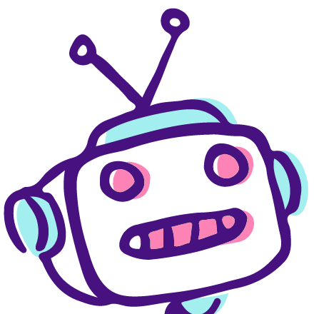

<!-- PROJECT LOGO -->

  

  <h3 align="center">ChatterBot</h3>

  

    An AI chatbot in Next.js with OpenAI's API.
    

   
<a href="https://chatterbot-rho.vercel.app/">View Demo</a>

<!-- TABLE OF CONTENTS -->
   

  
Table of Contents

  <ol>
    <li>
      <a href="#about-the-project">About The Project</a>
      <ul>
        <li><a href="#introduction">Introduction</a></li>
        <li><a href="#built-with">Built With</a></li>
      </ul>
    </li>
    <li><a href="#roadmap">Roadmap</a></li>
    <li><a href="#acknowledgements">Acknowledgements</a></li>
  </ol>

<!-- ABOUT THE PROJECT -->
## About The Project

### Introduction

I decided to take a break from all of my ongoing work and attempt a fun mini challenge. I followed my fellow bootcamper Jack White's tutorial for creating an AI chatbot with OpenAI's API. I worked on getting the API functionality up and running, and doing some basic styling to bring life to ChatterBot, the face of my chatbot.

### Built With

* 
* 
*  

(<a href="#readme-top">back to top</a>)

<!-- ROADMAP -->
## Roadmap

- [x] Set Up
    - [x] Boiler plate code
    - [x] Create HTML elements for weather data

(<a href="#readme-top">back to top</a>)

<!-- ACKNOWLEDGEMENTS -->
## Acknowledgements

* [Jack White's AI Chatbot Tutorial](https://nextjs-chatbot-tutorial.notion.site/Create-your-own-AI-chatbot-in-a-Next-js-app-320c7872da0046e1850f8bcdca3536da#6b26aae8a6ec4dd4a078b7c636dcd635)
* [OpenAI API](https://platform.openai.com/docs/overview)

(<a href="#readme-top">back to top</a>)

